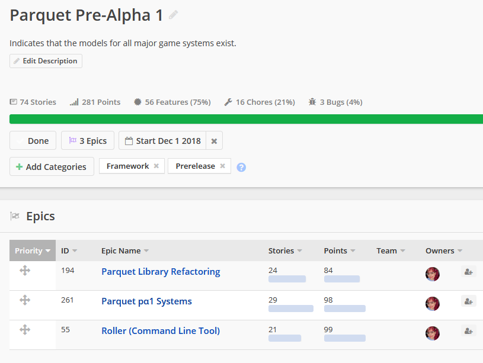
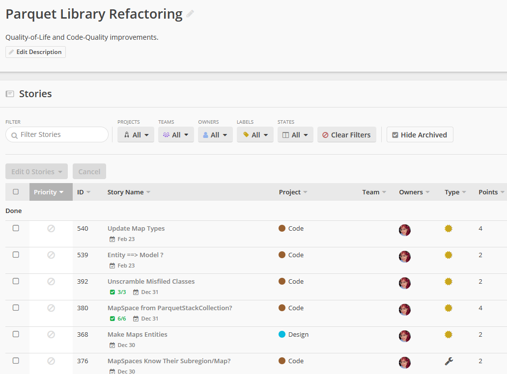
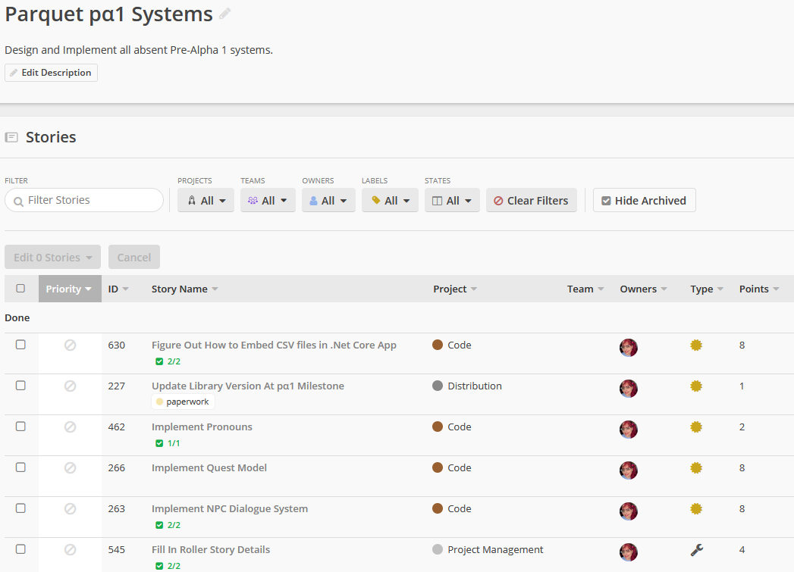
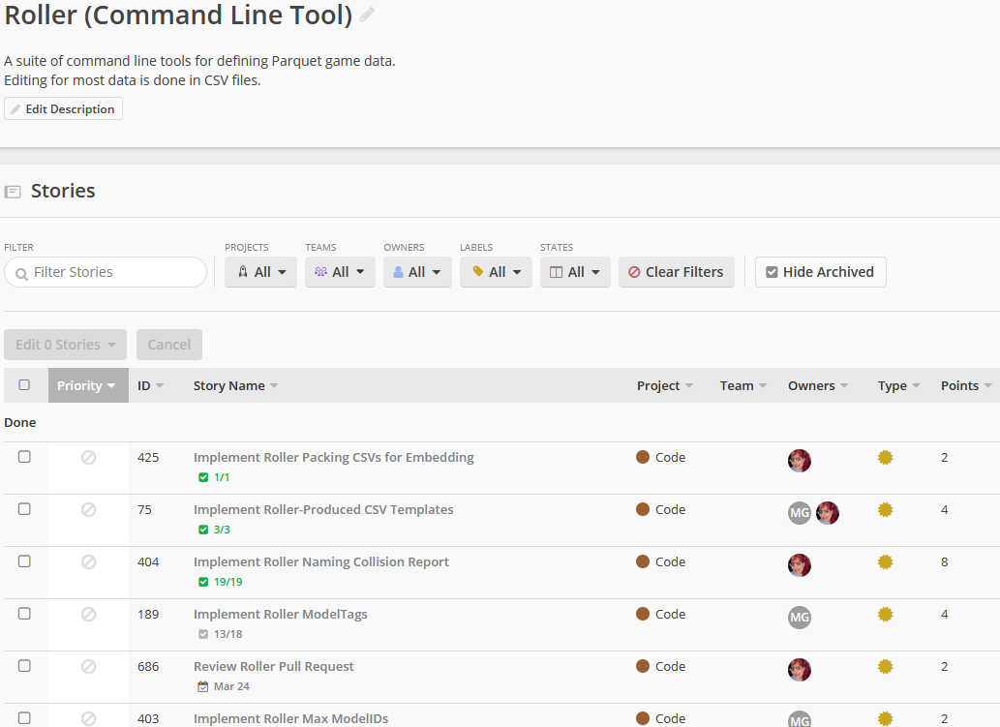

January 1, 2020
{: .float-right}

# New Year, 2020!

The Pre-Alpha 1 milestone for the library is starting to feel in reach!

This is pre-alpha for the library only, not yet tools, engines, or docs.
Maybe not the best practice, but hey I'm only one girl!

Here is how I described this milestone on GitHub:
  "Indicates that the models for all major game systems exist.
  Likely unstable. Breaking changes in API will still occur."

And here is what it looks like in Clubhouse:

Aiming to have it wrapped up by the end of the month!! 
Ambitious, but I've got good momentum at the moment
