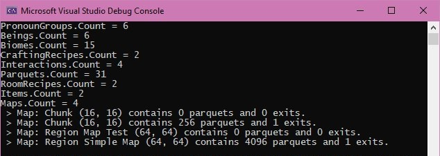
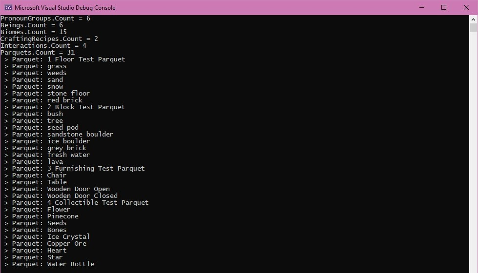
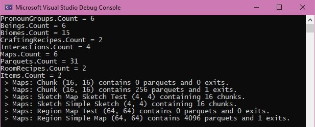

February 22, 2020
{: .float-right}

# Serialization Working!

Wooooooooooo!!! Serialization finally completely works for Parquet!!
All game data types can be saved and loaded without problems!

*Phew!*

That took about a solid month longer than I expected, but it's doooooone~!
21:07

