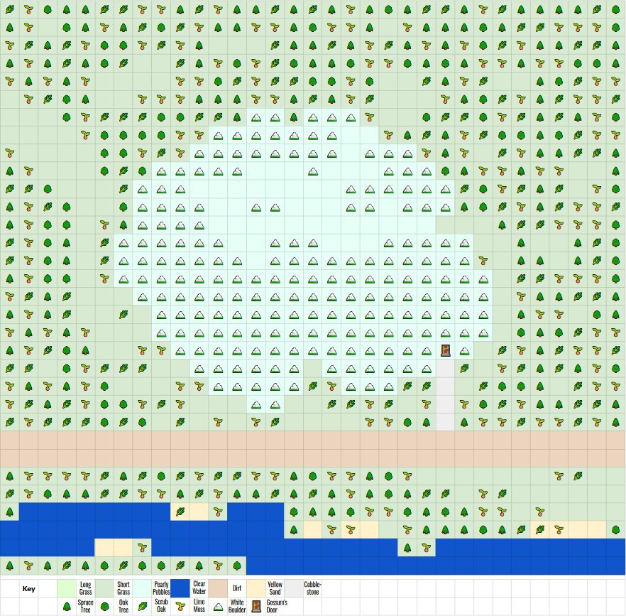

February 27, 2020
{: .float-right}

# Pre-Production Mockup

One of my partners asked me to produce a mockup of what an area might look like in a finished Parquet game.

This is obviously very early days still, but I thought it might be helpful to show what sort of thing I'm thinking of, so here it is!

