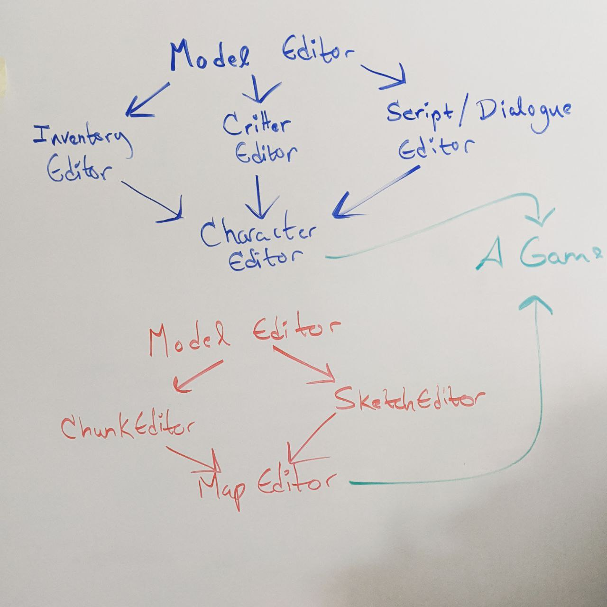

April 19, 2020
{: .float-right}

# GUI Tools

So, after wrestling with it for a month I've come to the conclusion that I do need to make some GUI tools after all.

I tried working with some existing tools, such as Tiled, but there are too many unusual concepts in Parquet, such as the four distinct layers of parquets in a stack, that general tools don't support well.
I'm also quite convinced now that 3D editing in a spreadsheet is not a good idea

So, I'll be making a GUI for editing world data.

The silver lining is that this gives me another area to practice and learn.  I've done in-house tools dev before, but this will give me a chance to take my time and do it well

Here's my initial sketch for how such a tool might be constructed~

I'm thinking about the name "Scribe" for this editor.
A scribe is a tool for working with parquets and tiles in real life, but it also sounds like an text authoring tool so I think it may be a good fit
