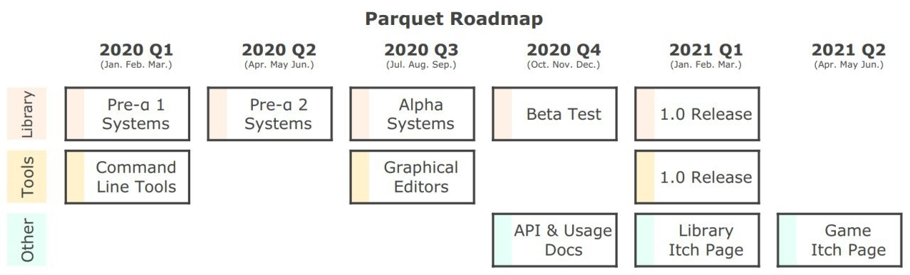

May 18, 2020
{: .float-right}

# Taking a Break

Last week my day-job team redesigned our summer roadmap so I was busy in meetings.
Also, starting this coming week in addition to my usual production and biz dev duties, I will be starting an online course to learn the technical side of Unreal 4 development.

So, I've decided to take a couple month's break from Parquet work so I can really focus on my main job.

Additionally, I decided to hold off on liquids or AI until after graphics are up and running.
I think that, like proc gen, it will be much easier to develop these once there is something on-screen to look at

That means the next thing on my Parquet to-do once I return from break is getting started on the GUI tools.
As I think I mentioned previously, I decided that I'll have to make some GUI tools after all as it's too cumbersome to design nested grid-based content in a normal spreadsheet editor.

With that in mind, here is a revised roadmap~~

Bare in mind that as ever, these are all just targets.  Since this is an in-my-freetime project it is likely they will slip.
