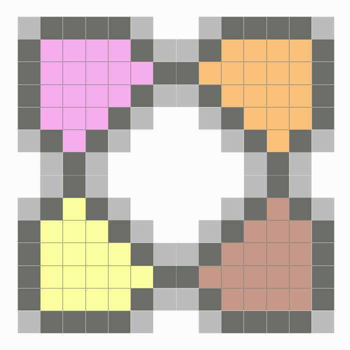
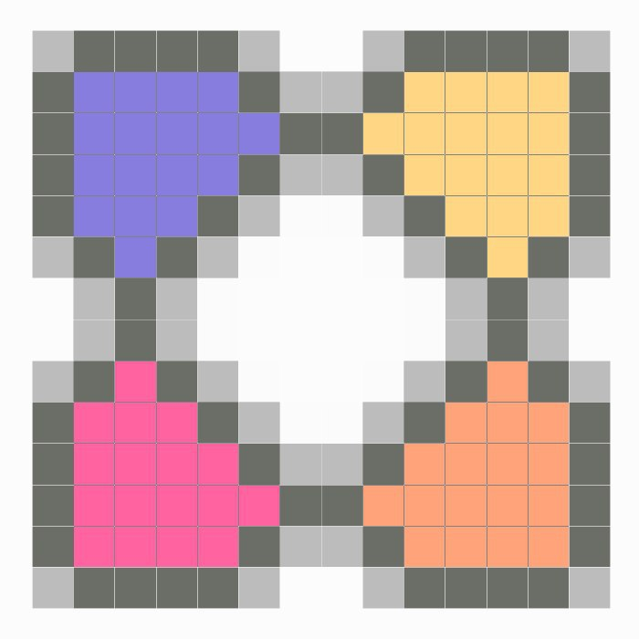

May 20, 2020
{: .float-right}

# Working on Logos

I've begun working on potential logos for the Parquet system.

Logo design is an exceptionally challenging arena, and I'm not trained in digital design work, but I figured
"better to start with anything; if interest warrants it, we can replace it later with a pro's work".
So, here we go!

My initial direction was to make something extremely simple that would be easy to recognize in silhouette,
and something based, at least conceptually, after real world parquets.

This is what I eventually came up with~~

 

I don't think this is going to win any awards, but it fits the bill.

Next, I pixelated the image to emphasize the low-fi nature of Parquet.

Then, I tried some color renditions.
Actually, I spent quite a while extending my research into palettes and came up with dozens of variants.
After I ran these by my polycule for feedback, these are two of the ones that were liked the best~~

