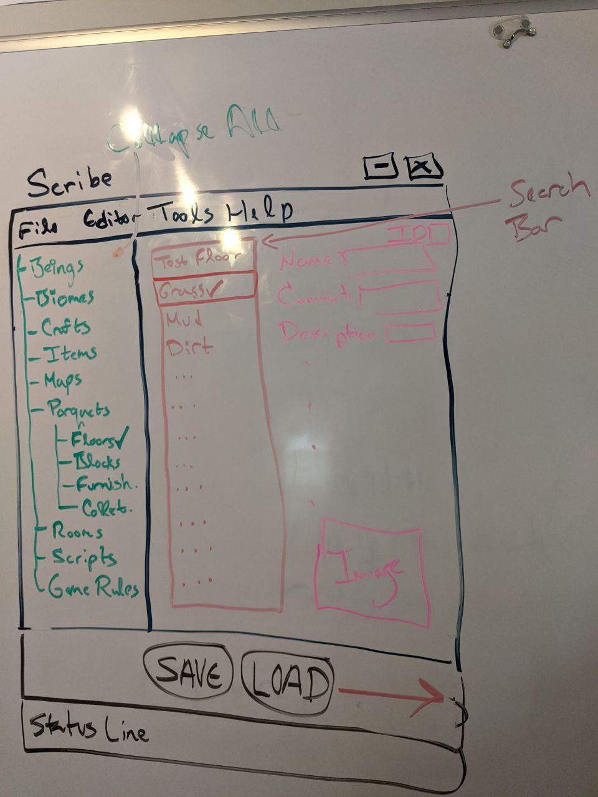

July 6, 2020
{: .float-right}

# Foresight, Hingsight

## Beginning Scribe

It's July!  And I'm finally free to work on Parquet again~!

So, I looked at *many, many* UI frameworks that can be used with .Net Core . . . and none of them are quite where they need to be.
But, there are many that do work.

After working through some tutorials to try out different options I settled on building Scribe in Windows Forms.
This will mean it will only run on Windows, buuuuut I don't think that's a huge issue for the present

Going to do some exploratory stuff along that route today and see what the prospects look like.
It's funny, WinForms has changed so little over the decades it's like I'm back in 1996 learning Visual Basic for the first time!

## C# For What Its Worth

In 2020, C# for gamedev doesn't sound quite as good as it did to me in 2018.
Increasingly, I feel like I should be moving to C or C++.
(I'd vastly prefer one of the new C replacement languages, but none of them are ready for commercial game dev yet.)
Buuuuuut I'm not eager to reimplement the entire library before I even finish it....

However, having worked through the WinForms tutorial I'm am feeling cautiously optimistic.
There were some speed bumps along the way as WinForms has only just recently been ported to .Net Core,
but I think it should work for my purposes.
Will be starting on a game object editor tomorrow!

