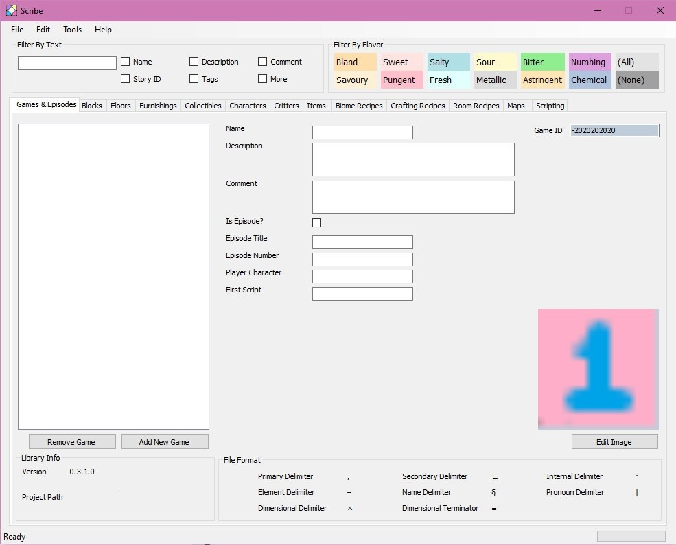

July 10, 2020
{: .float-right}

# First Look at Scribe

Well, got a lot done on the editor today.
Mostly in the "relearning how winforms work" department, but started in earnest on the layout as well.
Trudging through Microsoft's ever-changing specs is tiring!
But things are moving forward~~

Here's a first look at my editor, Scribe! 

