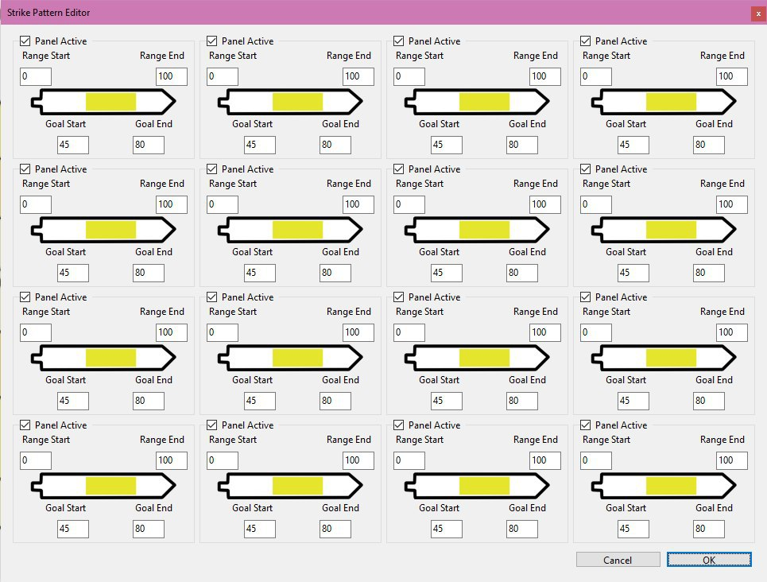

July 25, 2020
{: .float-right}

# Additional Tabs

## Dedicated Parquet Tabs

It took hours of working through various layout bugs, but I finally have lay out the parquets and beings tabs.
I decided to make a tab for each parquet type: floor, block, furnishing, and collectible.
It was too crowded all on one tab.

## Mini Game Editor Prototype

Also, here is a prototype for the UI for the crafting minigame editor! :D

