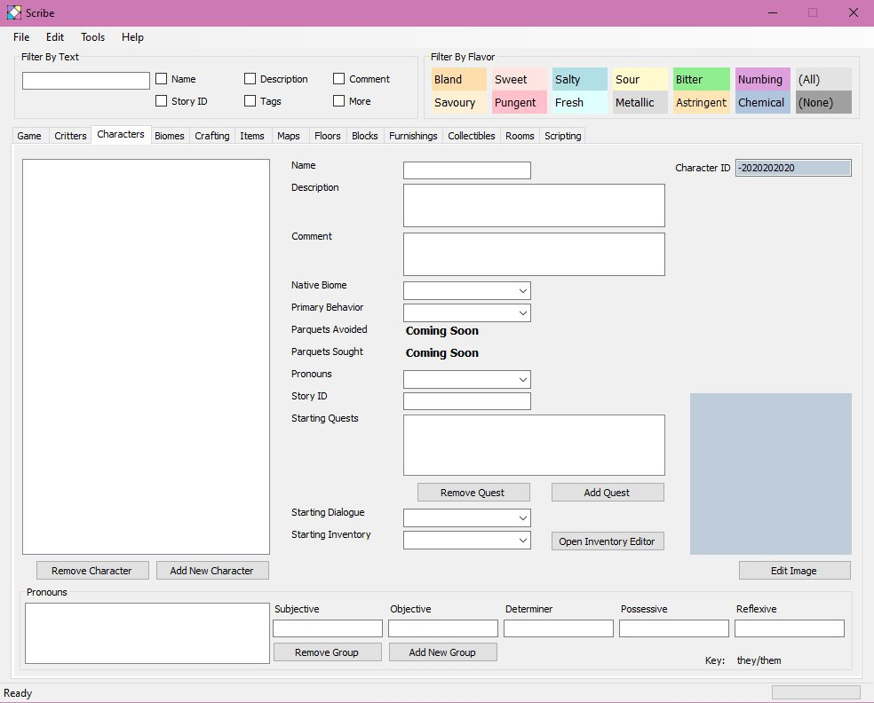

July 28, 2020
{: .float-right}

# Characters Tab

Here is the Character tab! Definitely the most complex so far~

With this, every bit of UI for this phase of the project has been laid out!
Next up, making things work!

I'll probably begin by simply querying the library to see if I can populate things like the library version correctly.
Wooooo! Onwards!
