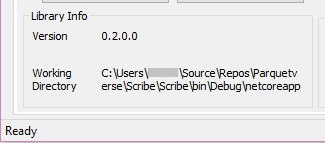
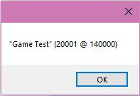

August 7, 2020
{: .float-right}

# Success Loading Data

## Library Metadata

Muahahahaaaa! Scribe now loads the Parquet library and is able to populate metadata from it~~ :3 

## Game Project Data

Even better, I just successfully loaded some game data in the editor! :DDD 
May not look like much now, but it soon will!

