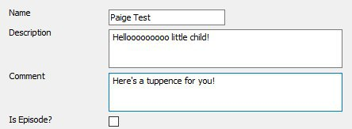
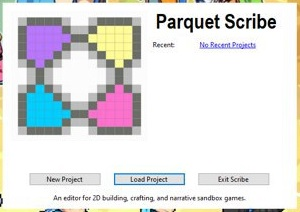

August 25, 2020
{: .float-right}

# Scribe Progress

## First Tab Wired Up

Wooo! The Games tab is all wired up!  You can now create, delete, and edit game metadata!!

Stuff is still rough around the edges usability-wise, but that will get fixed as I go along.

Now that I have a pattern on how to do this, a lot of the other tabs should go much more quickly!
On the other hand, some of the other tabs involve special controls that haven't been built yet (Games tab is just simple text boxes, check boxes, and buttons), so a few of them will take longer.

And of course once they're all done we still have to do the Map Editor, Script Editor, and the Strike Panel Editors, all of which are on the back burner for now.

Nevertheless, this is big progress!

## Splach Screen

Also, I had to make a new splash screen because opening the main editor window without initializing a project first was causing issues~

As I go through the wiring process I'm also turning up a bunch of usability issues in the library's API
which I'm glad I'm finding now rather than when I'm implementing the game itself....
