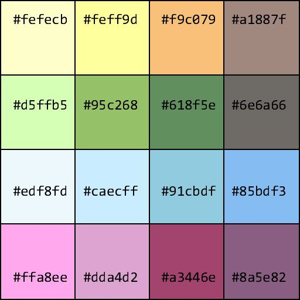

August 21, 2019
{: .float-right}

# Early Visual Design Work

## Prototype Palette

As part of setting up package and solution configuration, I found I needed to do some basic visual design work.
First thing to come out of this is a prototype palette.
This will change.  It is definitely not everything I want it to be.

But, it's a starting place!

## Logo Concept

The second thing that came out of this is this very rough draft of a logo.
Trying to riff off the whole wooden flooring blocks theme, but in a fun, abstract way~

