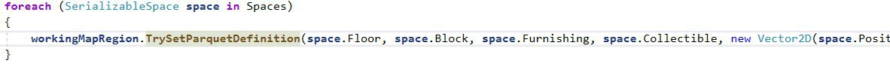

December 25, 2019
{: .float-right}

# Ah, yes....

My metamour drew my attention to a poor design I had made in the API which I feel is rather goofy  XD

Early coder feedback must be the early player feedback of library development!

"Ah, yes, I think I see what's suboptimal about this!"

(You've probably seen it right away, but just in case: here, an instance must be decomposed into its constituent parts in order to call a method that then simply recombines them.  Oops!)
