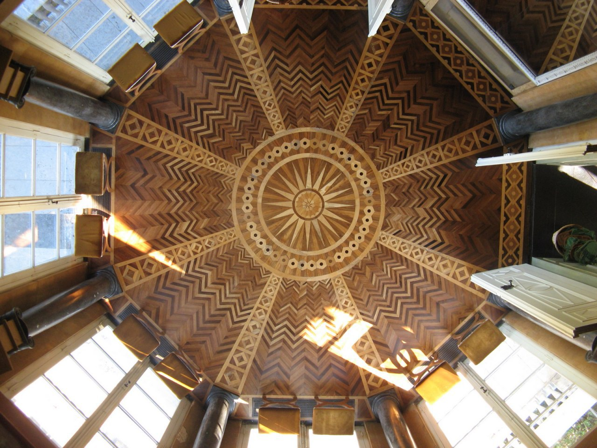

January 11, 2020
{: .float-right}

# A Beautiful Example of Real Life Parquets

Look at this heckin beautiful parquet floor from the 1700s

Apparently parquet replaced marble as flooring of choice for rich Europeans in the 1700s because it was easier to care for, lasted just as long, and didn't tend to rot the wooden beams under the flooring the way frequently-washed marble did
