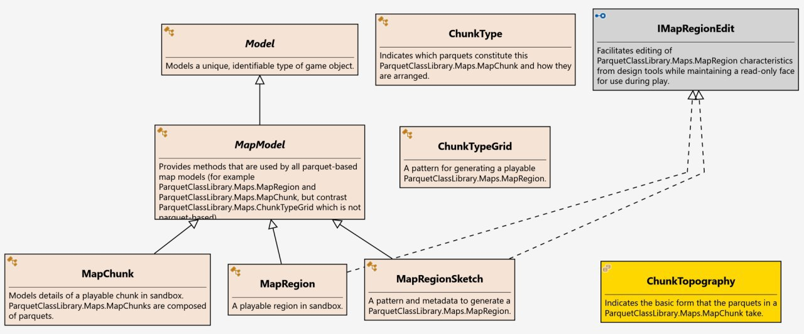
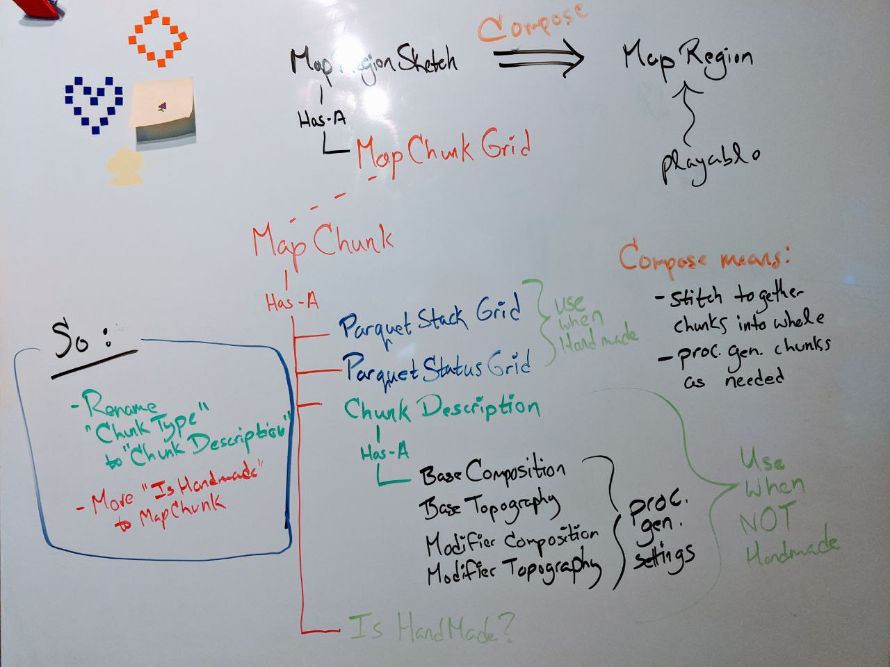

May 12, 2020
{: .float-right}

# Reworking Map Classes

Today I am reworking the map-related classes.
 
It's been a bit since I designed these so my first step was to study my own design and figure out what I was thinking!  XD

Here's a diagram of the old architecture:

This immediately feels wrong to me on looking over it now.

For one thing, MapChunk is a subunit of MapRegion or MapRegionSketch, so it's odd that it also inherits from MapModel.
Put another way, MapChunk, MapRegion, and MapRegionSketch are all collection classes, but MapRegionSketch collects MapChunks....

Another easy criticism is that the nomenclature is confusing.  What exactly is the difference conceptually between a region and a chunk?

Looking at the bigger picture, this whole subnamespace is much more complex than the other subnamespaces, which makes me feel like the design can be improved.

So, taking a break from my computer I did a lot of white-boarding and walking through my ideas with my partners and came up with this~

On the face of it, this definitely improves over the prior suggestion as MapChunk is no longer derived from MapModel and
the concerns of generated vs ungenerated content are more clearly divided.
It's also clear here that MapRegionSketch is really not much more than as a poorly-named MapChunkGrid.

Beyond the surface, this also turns out a bit knotty to implement, because all those MapChunks in MapRegionSketch ought to be stored as ModelIDs, but
there is as yet no 2D collection class for ModelIDs and the IGrid interface was designed only to work with reference types.
So a little revision is in order!
