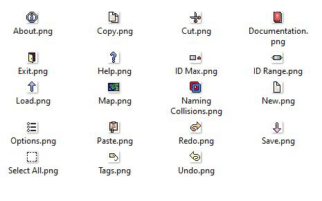
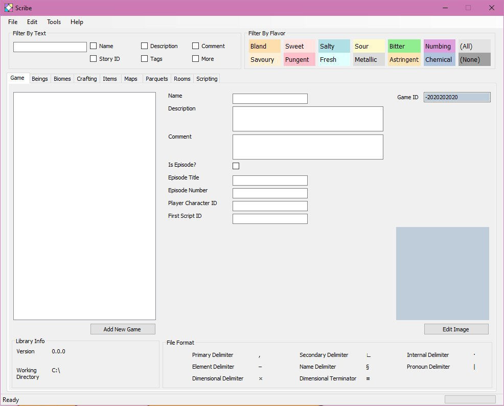

July 12, 2020
{: .float-right}

# More Early Scribe

Look at these cute little icons I made for Scribe!! :O
I didn't think I could do pixel icons this well!

And here's today's editor progress!

The fist tab is completely laid out!
Nothing works yet, but the UI is there.
This took a surprisingly long time, mostly cause I am new to this tool
but others should go quicker as intend to use this as a pattern for later ones.

Looking like an editor!
