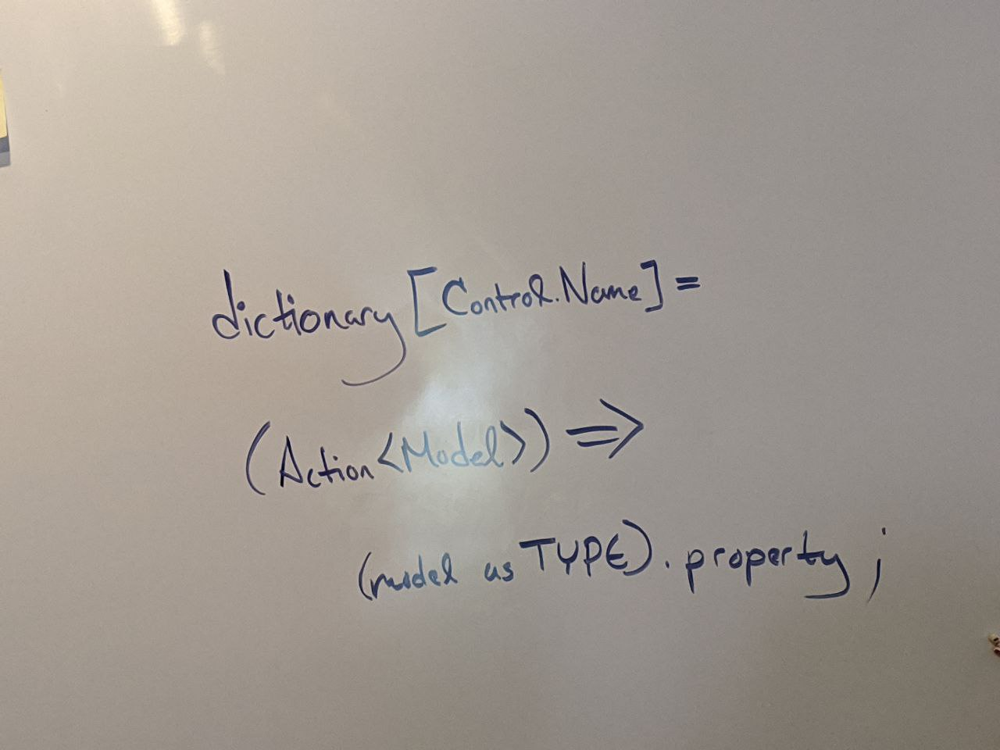

August 20, 2020
{: .float-right}

# Data Binding

So, with Solfege's help I've dived into building a dictionary to associate UI elements with Parquet models.

I found myself basically reinventing .Net data binding, so maybe I should have just used that system to being with,
although it still feels very heavy for an app like this.

These were how I broke down Solfege's ideas:

1 Determine which ModelCollection to query via association with the current tab.
2 Determine which ModelID to use via tab's primary ListBox's SelectedIndex.
3 Determine which property to adjust by parsing Control.Name -- or better yet, by caching a reference.
4 Use existing names to establish a name-to-property dictionary.

Going to maybe some back-end changes to see if I can make simplify the code :p
