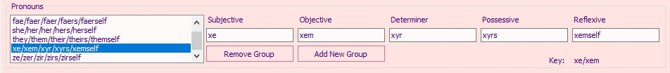

October 22, 2020
{: .float-right}

# Working with Pronouns

## Current Interface

Yuri Jam is going well, so I took a short break from my break today to do a little Scribe work.

And, I got the panel for defining sets of pronouns working!

## Unresolved Issues

As was pointed out by a friend, this system is pretty basic.
For example, it does not offer support for adapting verb conjugations as in:

    She is going to the store.
    They is going to the store.
    They are going to the store.

As is always the case with grammar in natural languages, people take different stances what form is correct for singular they.
But regardless of the stance taken, the current system puts the entire burden of solving the dilema on the writer.

I'm not sure if that's the best approach, but I don't want to implement any additional logic regarding this issue until I have actual text to work with.
So, this is how I'm leaving it for now.
We can always revise once a game is under development!
