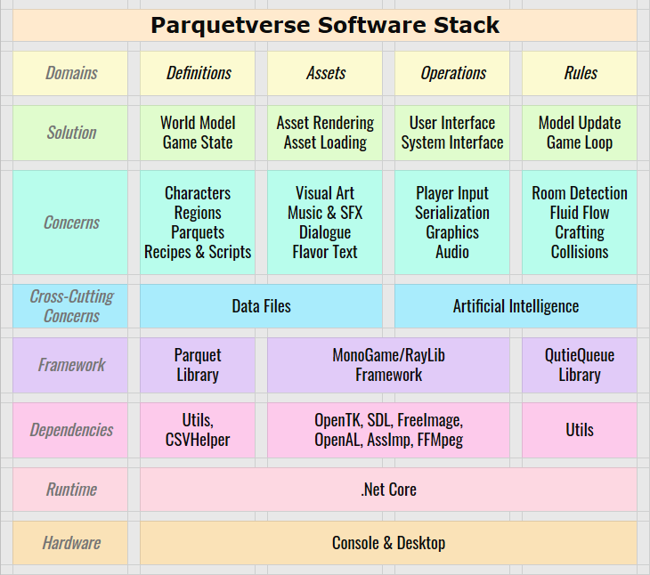

December 27, 2020
{: .float-right}

# Whole Game Architecture

I eased back into development by taking stock of where things are, and where I am aiming to go.

I've been reading a lot about how other game frameworks and engines are architected, including examining code on GitHub.
Working from this, I charted out the big picture ~~ the first time I've done this since early 2019.

One of the most important parts of this was taking a look at what an entire game that uses Parquet might look like,
seeing what pieces Parquet itself will provide and what pieces it will not.

## Parquetverse Information Flow

Here is my current plan as to how a Parquetverse game might be architected, and how information would be passed between subsystems.

## Parquetverse Control Flow

Here is my current high level guess as to how a Parquetverse game might be programmed.

## Parquetverse Software Stack

And here is the software stack I am thinking of for my own Parquetverse games.
I have not yet decided on the engine/framework, but after a lot of research I am leaning heavily toward MonoGame or RayLib.

Of course, detals will change as I go, but it's a good start!

I'd like to do a UML-style object relationship chart as well, but it is probably too early to jump into that just yet~
