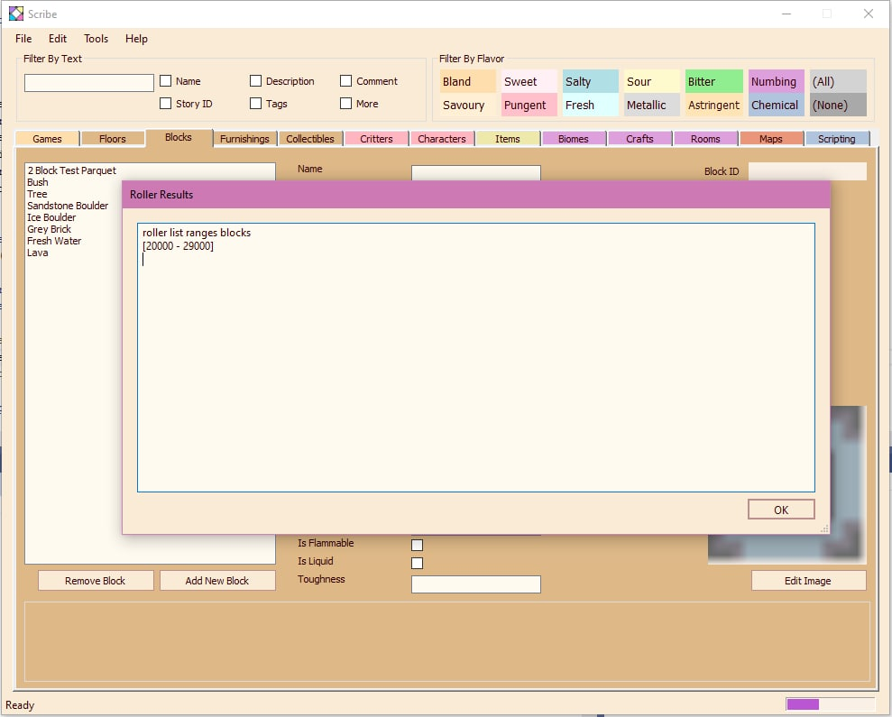

February 1, 2021
{: .float-right}

# Roller-Scribe Integration

You can now call Roller from within Scribe!

I've never made a GUI app that talked to a command line tool on Windows before, so this was educational for me ^_^

