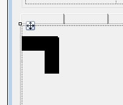

February 3, 2021
{: .float-right}

# Visual Progress

## Test Graphics

Major minor breakthrough here, drawing two test parquet graphics on top of one another with transparency and no antialiasing,
i.e., pixel-perfect and layered!

One image is a horizontal black bar, the other is vertical.
They are both 10x10 pixels, while they are drawn here 60x60.

## New Logo

Also, here is a new version of the Parquet logo.
Much cleaner than the old one, I like it!

