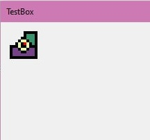

February 4, 2021
{: .float-right}

# Custom Control for Pixel Art

Haha!
After struggling all day I have succeeded in creating a custom WinForms UI Control that displays 4 images layered on top of one another with transparency and pixel-perfect!!

This is enough for a stacked Floor, Block, Furnishing, and Collectible, and is what I need to implement each cell of the map editor!

Now on to the next step: creating the right number of these in a grid at runtime and loading them with the appropriate graphics.
(The below graphic is just simple shapes designed to be easy to see when layered....)

