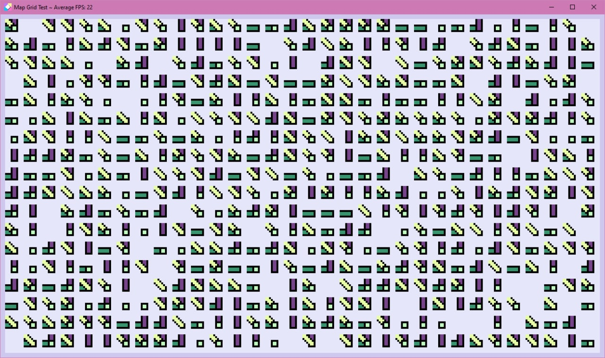

February 6, 2021
{: .float-right}

# Parquet Display Progress

Huzzah!
Full map being painted at 22 FPS.
Target is 30 FPS so there is some work to do improving that, but overall these are great results!
This is one control painting all ParquePacks, though, so now I need to capture mouse clicks and figure out which exact cell is being clicked on~~

