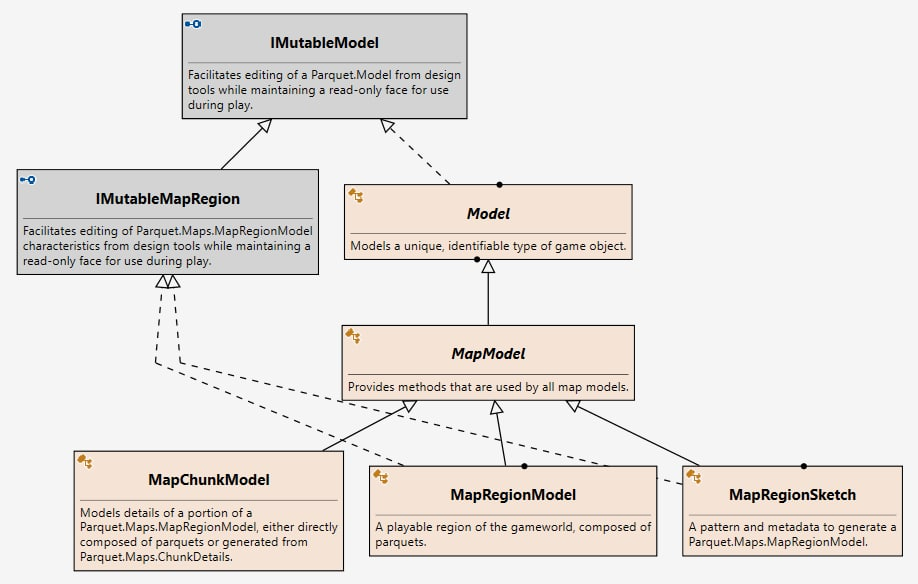

February 12, 2021
{: .float-right}

# Rearchitecting Map Classes

Got a good bit done today.

My next big riddle is untangling my Map classes.
They were the second thing I created, after the parquet classes, back in Jan 2019,
and while I tried to keep them up to date with evolving ideas about how the library will work, I realize now that they are pretty badly out of sync.

Soooooo, before I build an editor for them I need to modernize them!

Here's the classes as they currently exist, mostly here just so I can refer to this diagram more easily while I work out some issues on the whiteboard~~
