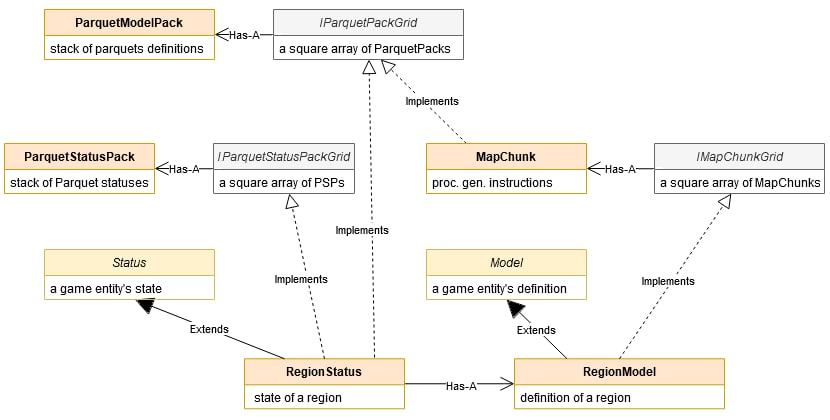

February 22, 2021
{: .float-right}

# Map Classes Rearchitected

Great progress today!
The API has solidified and under the hood things are much simpler!

Here's the revised version~~

Today itself I didn't make as much progress as I'd have liked since I only worked about three hours.
Still, things are coming into shape

I rewrote MapChunk and most of RegionModel already.
Some stuff with region model I'm not sure what the best approach is, so I'm going to let my brain work on it a bit while I do chores around the house ^_^
