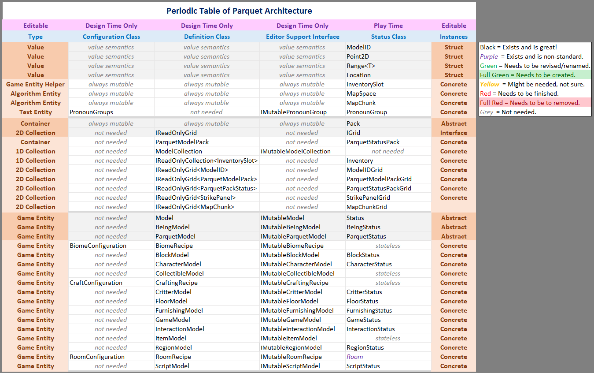

February 25, 2021
{: .float-right}

# Revised API Diagram

Major progress in recent days!

The map/region classes are completely revised!
Some minor bits to do with proc gen and room detection will need to be adjusted after the tech demo, so I stubbed them in for now.

Since this expanded to become a major revision of the API in general, I produced a new version of this document to lay out the intent behind the classes~~

I don't anticipate further API changes before the tech demo.
(The box around inventory slot doesn't mean anything btw)

I still have to generate new test data for maps and beings as those have both changed bunches,
but then we will be back to GUI editor land! :D
