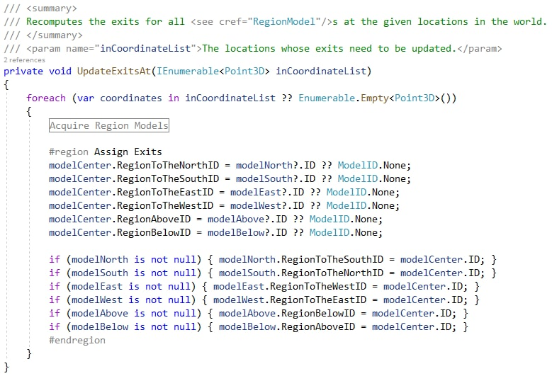

March 22, 2021
{: .float-right}

# Region Adjacency

Here it is, the logic for which this entire Layout Tool was created and which everything I've written in the past two weeks serves~~

Everything for the Layout Tool is now implemented!

Now working my way through the usage testing phase.... 😅
