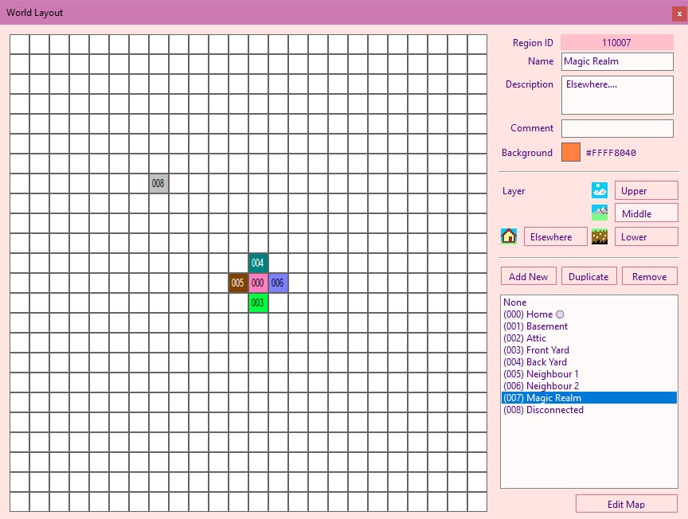

March 30, 2021
{: .float-right}

# Layout Editor Working

The layout tool works! ^___^

I'm sure there are some bugs hiding in there still, but the simplest happy path is error-free.

At this point I'm ready to move on to the next big task.

Thanks so much for helping me to realize I needed this tool, Solfege!
