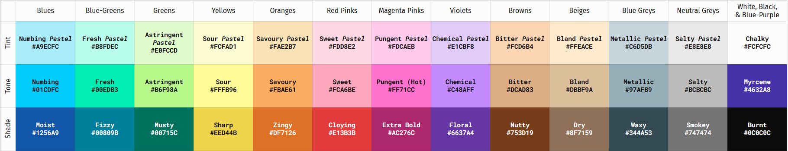

April 4, 2021
{: .float-right}

# Parquetverse Palette

After a lot of work, Lilly and I have revised the Parquet color palette!

Here is the new version~

I like it a lot better than the old one.

You will notice that this associates official colors with each flavor in the Flavor system.

I want to run those associations by Solfege sometime when they are off work to make sure they work well for them.
Because of the flavor theme, we gave flavor names to all the other colors, too.

In addition to drawing from the old palette and the current logo, this also draws inspiration from the original Dragon Quest palette and the UI needs of Scribe.
Oh! Also this draws inspiration from Cowboy Mike's Own Original Red Hot Ricochet Barbecue Sauce (Now Available in new EXTRA BOLD)! 

Hopefully folks like it as much as I do!
Thanks so much for all your help on this, Lilly!!
